# 💎 EyeJewelry Admin & E-Commerce UI Screens (INTERNSHIP PROJECT)

This repository showcases the UI screens of my **EyeJewelry platform**, built using modern web technologies.  
The project focuses on delivering a clean, user-friendly experience for both customers and admin users.

## EyeJewelry – Inventory Management System -

Developed a role-based inventory system to streamline diamond stone tracking and inventory operations. Enabled real-time stock visibility, 
improved data organization, and simplified transaction management through dedicated modules for clients, vendors, and sales. 
Enhanced efficiency by providing centralized dashboards and automated data handling features.

---

--
## 🚀 Project Highlights
- MERN Stack Project
- Responsive Layout
- Modern E-commerce Flow

--

## 🚀 Key Features
- 🔐 Authentication (Login & Signup)
- 🛒 Cart & Wishlist Management
- 🔍 Search Functionality
- 📊 Admin Dashboard & Data Upload
- 📈 Sales & Transaction Tracking
- 👥 Client & Vendor Management
- 🧾 Log & History Tracking

---

## 🖼️ UI Screens Preview

### 🔐 Authentication
| Login Page | Signup Page |
|-----------|------------|
| 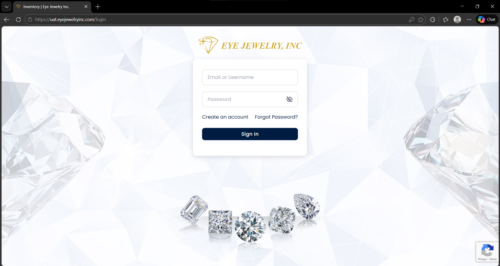 | 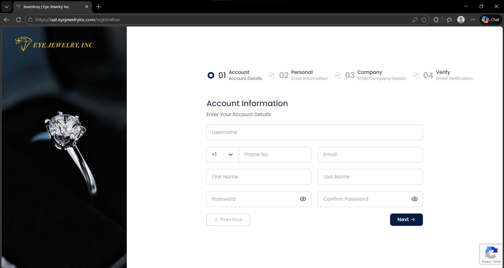 |

---

### 🛍️ User Features
| Cart Page | Watchlist Page | Search Page |
|----------|--------------|-------------|
| 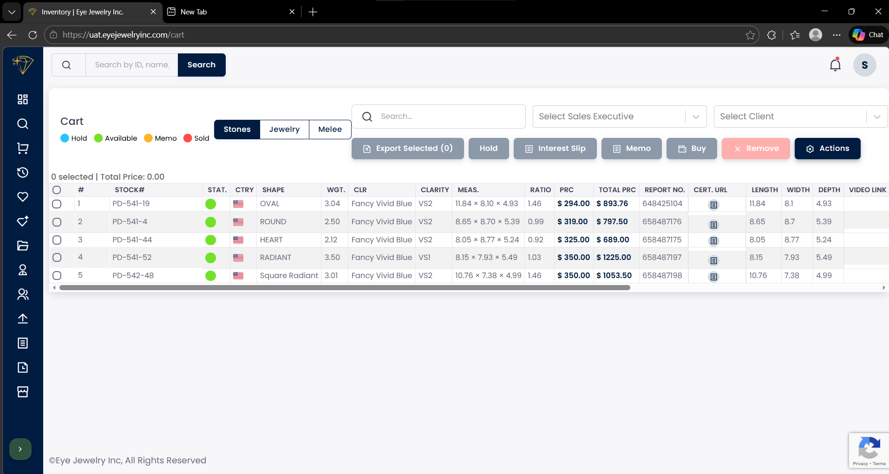 | 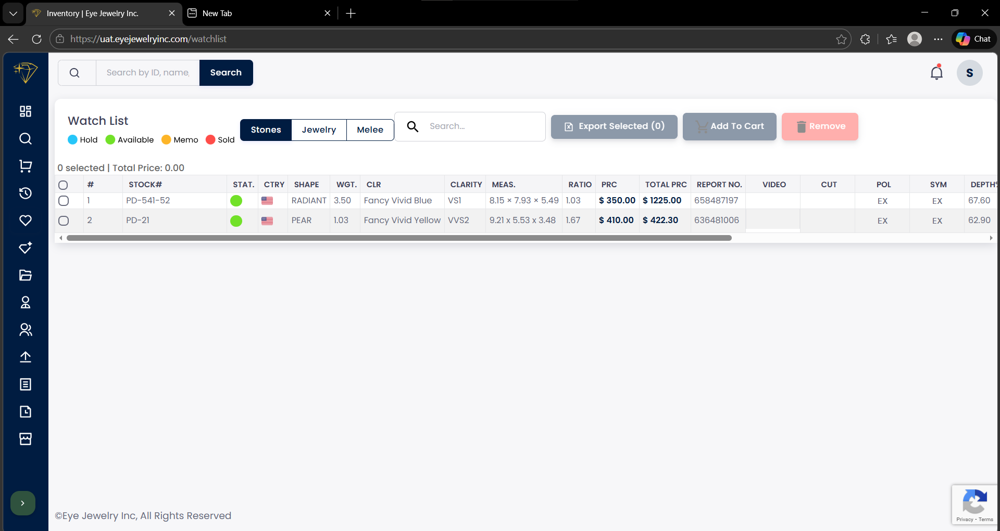 | 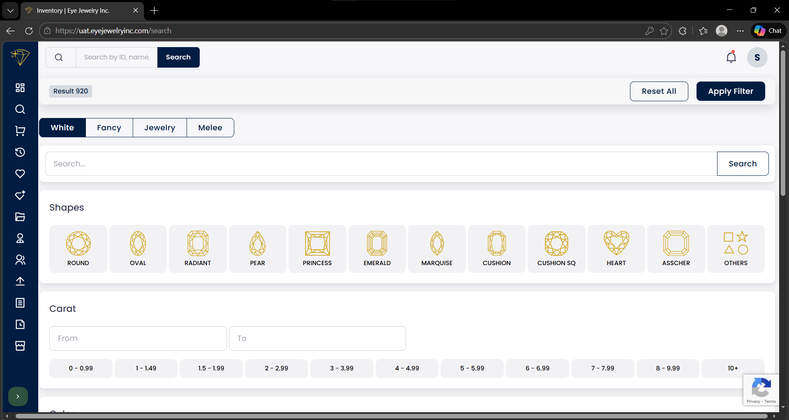 |

---

### 📊 Admin & Management
| Clients | Sales Executive | Vendor Management |
|--------|----------------|------------------|
| 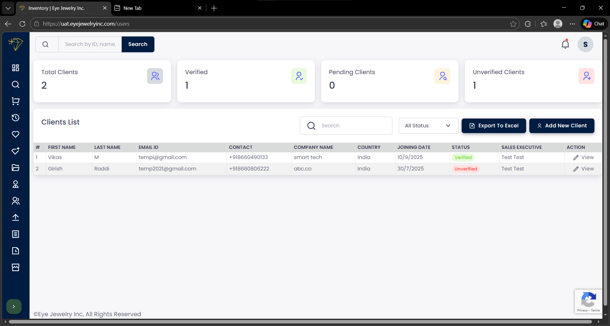 |  | 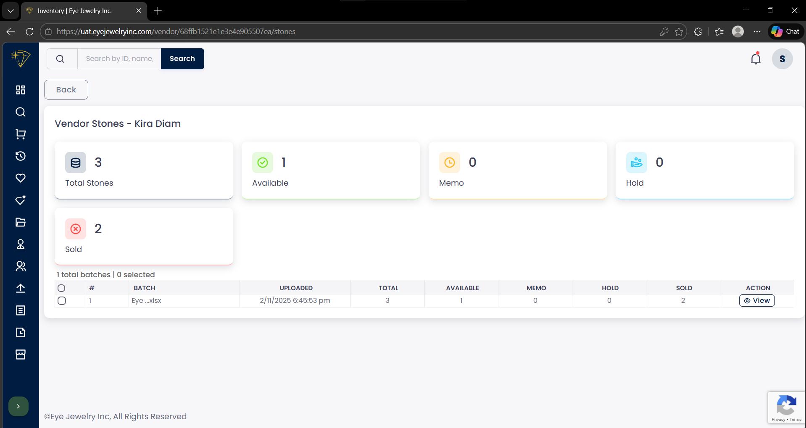 |

---

### 🗂️ Data & Transactions
| Data Upload | Transactions History | Log History |
|------------|---------------------|-------------|
| 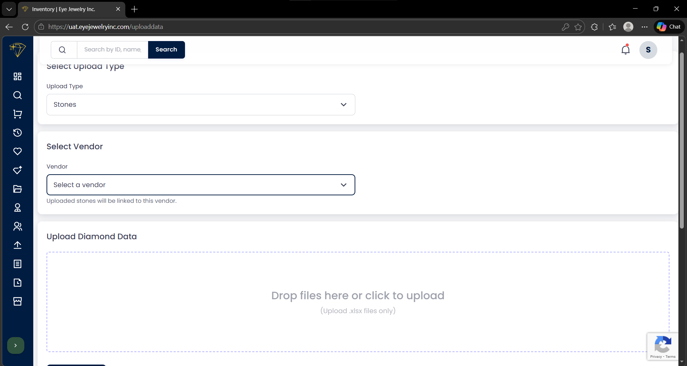 | 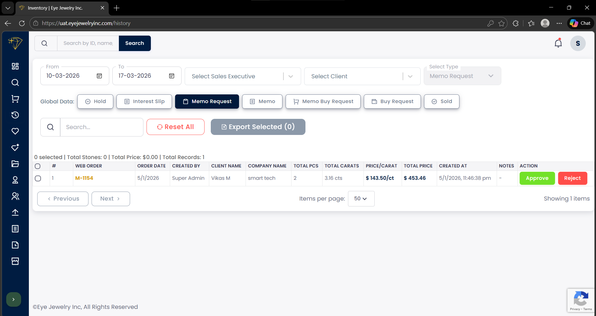 | 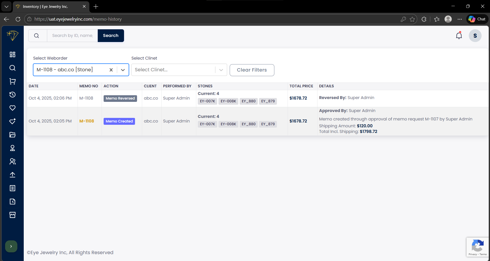 |

---

### ⚙️ System UI
| Side Panel | Stone Master |
|-----------|-------------|
| 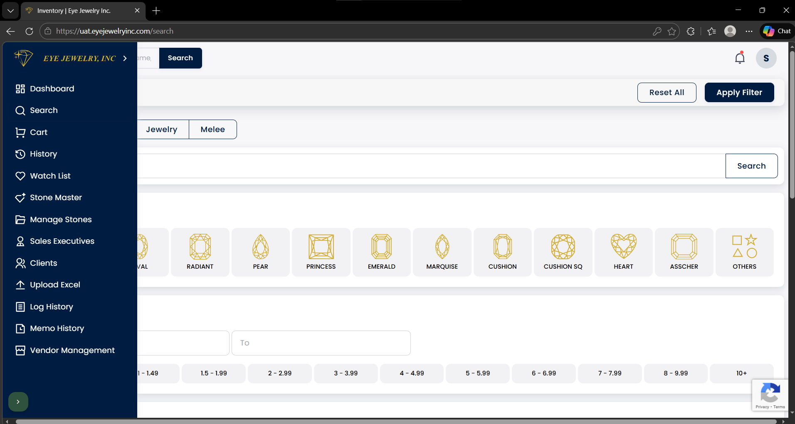 | 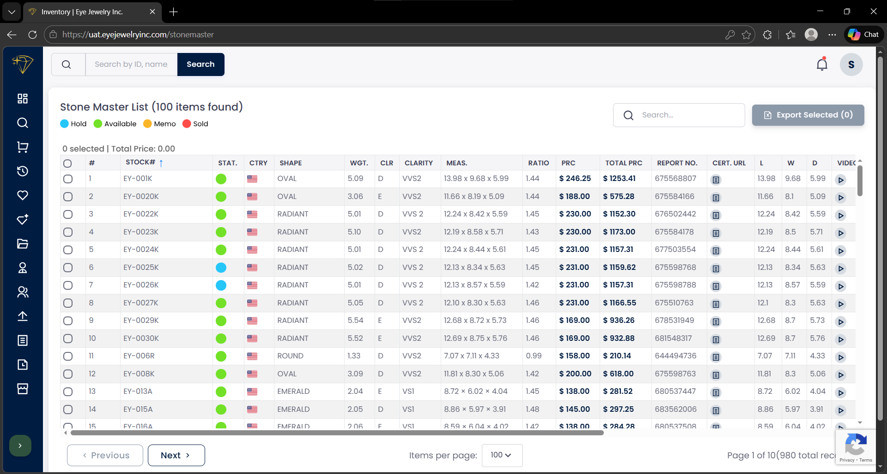 |

---

## 📌 Note
This repository contains only UI screenshots for demonstration purposes.  
Source code is not included.

---

## 👨‍💻 Author
**Girish**  
girishraddiplc@gmail.com